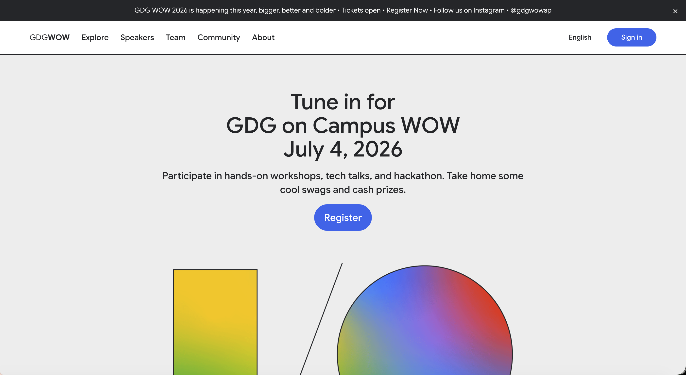

# GDGoC World of Wonders 2026 🚀

[](https://io.google/2024/)

**GDGoC WOW AP 2026** is a flagship developer event website designed with the
modern aesthetic and functional parity of **Google I/O 2024**. This project
serves as the central hub for the event, featuring landing pages, registration
flows, and interactive session exploration.

---

## ✨ Key Features

- 📱 **Fully Responsive Design**: Pixel-perfect layout from mobile to 1440px+
  flagship viewports.
- 🎨 **Premium Aesthetics**: Implementing the official Google I/O 2024 design
  system, including glassmorphism, fluid animations (Framer Motion), and a
  custom theme.
- 🌗 **Dark Mode Support**: Seamless transition between light and dark themes
  with system-level detection.
- 🧭 **Advanced Navigation**: Custom sticky headers, scroll-spy integration, and
  an intuitive mobile navigation drawer.
- 🎫 **Registration Flow**: A multi-step registration process with real-time
  validation and localized state management.
- 🔍 **Interactive Explore Page**: Clean and powerful session filtering with
  dynamic URL synchronization.
- 🏃 **High Performance**: Optimized using Next.js 15+, Tailwind CSS v4, and
  modern image formats (WebP/SVG).

---

## 🛠️ Tech Stack

- **Core**: [Next.js](https://nextjs.org/) (App Router)
- **Language**: [TypeScript](https://www.typescriptlang.org/)
- **Styling**: [Tailwind CSS v4](https://tailwindcss.com/)
- **Animations**: [Framer Motion](https://www.framer.com/motion/)
- **Components**: Radix UI (Headless primitives) & Lucide React
- **Icons**: Official Google I/O 2024 SVG Assets

---

## 🚀 Getting Started

### Prerequisites

- Node.js 18.x or later
- npm or pnpm

### Installation

1. Clone the repository:
   ```bash
   git clone https://github.com/manasmalla/wow2026.git
   ```

2. Install dependencies:
   ```bash
   npm install
   ```

3. Run the development server:
   ```bash
   npm run dev
   ```

Open [http://localhost:3000](http://localhost:3000) with your browser to see the
result.

---

## 📂 Project Structure

- `src/app`: Next.js App Router pages and layouts.
- `src/components`: Reusable UI components and section blocks.
- `src/services`: Data fetchers and mock services.
- `src/data`: JSON configuration and static content.
- `public`: Static assets including images, icons, and localized resources.

---

## 👥 Contributors

A huge thanks to the team making this happen:

- **Manas Malla** ([@manasmalla](https://github.com/manasmalla)) - Lead
  Developer
- **Chaitanya Sameer Chalasani** ([@Chai-S](https://github.com/Chai-S))
- **Sharvan Babu Kakarla** ([@sharvanbabu](https://github.com/sharvanbabu))

---

## 🤝 Contributing

Contributions are welcome! Please feel free to submit a Pull Request.

---

## 📄 License

This project is for educational and community purposes. Design assets are
property of Google.

---

<p align="center">Made with ❤️ by the GDGoC GITAM Team</p>
